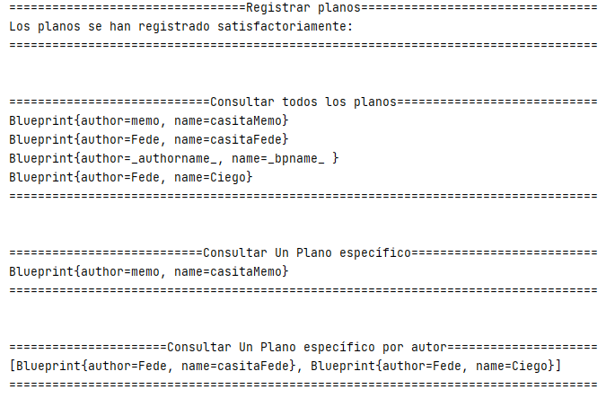
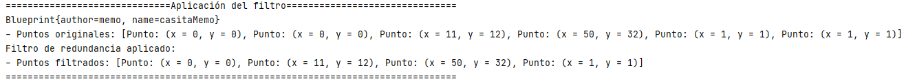
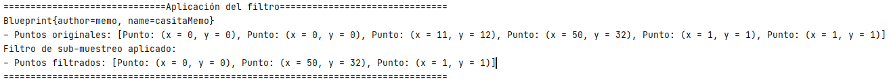

### Escuela Colombiana de Ingeniería

### Arquitecturas de Software
## Laboratorio Componentes y conectores  Middleware- gestión de planos
### Dependencias
* [Ejercicio introductorio al manejo de Spring y la configuración basada en anotaciones](https://github.com/ARSW-ECI-beta/DIP_DI-SPRING_JAVA-GRAMMAR_CHECKER).

> Se realizó en el siguiente github [Ejercicio introductorio a Spring](https://github.com/memo1019/Lab04-ARSW_Ejercicio_Introductorio).

### Descripción
En este ejercicio se va a construír un modelo de clases para la capa lógica de una aplicación que permita gestionar planos arquitectónicos de una prestigiosa compañia de diseño. 


### Parte I.

1. Configure la aplicación para que funcione bajo un esquema de inyección de dependencias, tal como se muestra en el diagrama anterior.


	Lo anterior requiere:

	* Agregar las dependencias de Spring.
	* Agregar la configuración de Spring.
	* Configurar la aplicación -mediante anotaciones- para que el esquema de persistencia sea inyectado al momento de ser creado el bean 'BlueprintServices'.
	
	Se agregó la etiqueta service a la clase InMemoryBlueprintPersistence:
	> ```java
	> @Service("inMemoryBlueprintPersistence")
	> public class InMemoryBlueprintPersistence implements BlueprintsPersistence{
	> ```
	Luego con la etiqueta @Autowired y @Qualifier hacemos referencia en BlueprintServices a InMemoryBlueprintPersistence.
	> ```java
	> @Service("BlueprintsServices")
	> public class BlueprintsServices {
	> 	@Autowired
	> 	@Qualifier("inMemoryBlueprintPersistence")
	> 	BlueprintsPersistence bpp=null;
	> ```


2. Complete los operaciones getBluePrint() y getBlueprintsByAuthor(). Implemente todo lo requerido de las capas inferiores (por ahora, el esquema de persistencia disponible 'InMemoryBlueprintPersistence') agregando las pruebas correspondientes en 'InMemoryPersistenceTest'.

	En la clase InMemoryBlueprintPersistence:
	> ```java
	> @Override
	> public Blueprint getBlueprint(String author, String bprintname) throws BlueprintNotFoundException {
	> 	return blueprints.get(new Tuple<>(author, bprintname));
	> }
	> 
	> @Override
	> public Set<Blueprint> getBlueprintsByAuthor(String author) throws BlueprintNotFoundException {
	> 	Set<Blueprint> Author=new HashSet<Blueprint>();
	> 	for(Tuple<String,String> tupla : blueprints.keySet()){
	> 		if(tupla.getElem1().equals(author)){
	> 			Author.add(blueprints.get(tupla));
	> 		}
	> 	}
	> 	return Author;
	> }
	> ```
	
	En la clase BlueprintServices:
	> ```java
	> public Blueprint getBlueprint(String author,String name) throws BlueprintNotFoundException{
	> 	return bpp.getBlueprint(author,name);
	> }
	> 
	> public Set<Blueprint> getBlueprintsByAuthor(String author) throws BlueprintNotFoundException{
	> 	return bpp.getBlueprintsByAuthor(author);
	> }
	> ```

3. Haga un programa en el que cree (mediante Spring) una instancia de BlueprintServices, y rectifique la funcionalidad del mismo: registrar planos, consultar planos, registrar planos específicos, etc.

	Se realizó la clase Main para comprobar las funcionalidades de la aplicación:
	> ```java
	> public class main {
	> 	public static void main(String []args) throws BlueprintPersistenceException, BlueprintNotFoundException {
	> 		//Definición del archivo de contexto para Spring.
	> 		ApplicationContext ac = new ClassPathXmlApplicationContext("applicationContext.xml");
	> 		//Creación de la instancia de la clase de servicios.
	> 		BlueprintsServices cs = ac.getBean(BlueprintsServices.class);
	> 		//Registro de planos.
	> 		//Consulta de planos.
	> 		//Consulta de un plano específico.
	> 		//Consulta de un plano por un autor.
	> 	}
	> }
	> ```
	
	Luego de implementar las secciones comentadas, los resultados son los siguientes:
	
	> 

4. Se quiere que las operaciones de consulta de planos realicen un proceso de filtrado, antes de retornar los planos consultados. Dichos filtros lo que buscan es reducir el tamaño de los planos, removiendo datos redundantes o simplemente submuestrando, antes de retornarlos. Ajuste la aplicación (agregando las abstracciones e implementaciones que considere) para que a la clase BlueprintServices se le inyecte uno de dos posibles 'filtros' (o eventuales futuros filtros). No se contempla el uso de más de uno a la vez:
	
	Para hacer los filtros primero se creó una interfaz y luego se hicieron dos implementaciones diferentes de dicha interfaz, una para cada tipo de filtro:
	
	* (A) Filtrado de redundancias: suprime del plano los puntos consecutivos que sean repetidos.
	
	> ```java
	> @Override
	> public Blueprint filter(Blueprint blueprint) {
	> 	System.out.println("Filtro de redundancia aplicado: ");
	> 	ArrayList<Point> puntos = blueprint.getPoints();
	> 	ArrayList<Point> puntosRepetidos = new ArrayList<>();
	> 	Point lastPoint = puntos.get(0);
	> 	for (int i = 1; i < puntos.size(); i++) {
	> 		Point p = puntos.get(i);
	> 		if (lastPoint.compare(p)) {
	> 			puntosRepetidos.add(p);
	> 		} else {
	> 			lastPoint = p;
	> 		}
	> 	}
	> 	for (Point p : puntosRepetidos) {
	> 		puntos.remove(p);
	> 	}
	> 	return new Blueprint(blueprint.getAuthor(), blueprint.getName(), puntos);
	> }
	> ```
	
	Al probar el filtro de redundancia el resultado es el siguiente:
	
	> 
	
	* (B) Filtrado de submuestreo: suprime 1 de cada 2 puntos del plano, de manera intercalada.
	
	> ```java
	> @Override
	> public Blueprint filter(Blueprint bluePrint) {
	> 	System.out.println("Filtro de sub-muestreo aplicado: ");
	> 	ArrayList<Point> blueprintPoints = bluePrint.getPoints();
	> 	for (int i = blueprintPoints.size() - 1; i >= 0; i--) {
	> 		if (i % 2 == 0) {
	> 			blueprintPoints.remove(i);
	> 		}
	> 	}
	> 	return new Blueprint(bluePrint.getAuthor(), bluePrint.getName(), blueprintPoints);
	> }
	> ```
	
	Al probar el filtro de sub-muestreo el resultado es el siguiente:
	
	> 

5. Agrege las pruebas correspondientes a cada uno de estos filtros, y pruebe su funcionamiento en el programa de prueba, comprobando que sólo cambiando la posición de las anotaciones -sin cambiar nada más-, el programa retorne los planos filtrados de la manera (A) o de la manera (B). 

	Solo cambiando una etiqueta en la clase BlueprintsServices se cambia el filtro que se utiliza para el plano:
	
	Con la etiqueta de la siguiente manera se utiliza el filtro de redundancia

	> ```java
	> @Autowired
	> @Qualifier("RedundanciaFiltro")
	> BluePrintFilter filter;
	> ```
	> 

	Mientras que con la etiqueda de la siguiente manera se utiliza el filtro de sub-muestreo
	
	> ```java
	> @Autowired
	> @Qualifier("SubmuestreoFiltro")
	> BluePrintFilter filter;
	> ```
	> 
	
